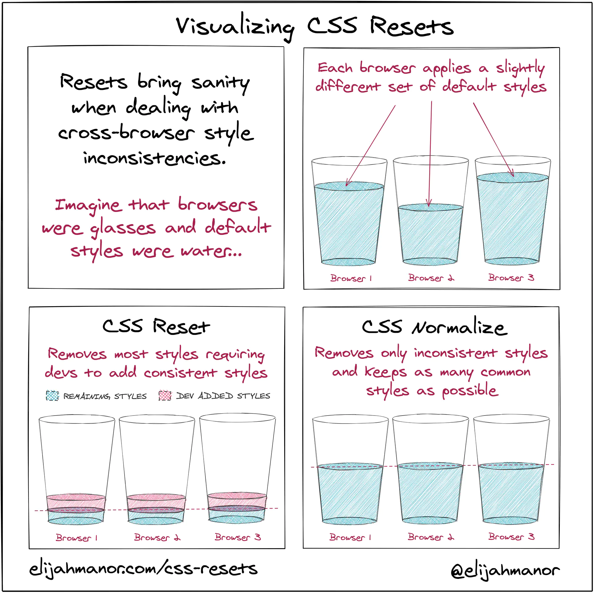

Answers to [Front-end Job Interview Questions - CSS Questions](https://github.com/h5bp/Front-end-Developer-Interview-Questions/blob/main/src/questions/css-questions.md). Although the [Front-end Interview Handbook](https://github.com/yangshun/front-end-interview-handbook/blob/master/contents/en/css-questions.md) has given answers, i'd like to answer these questions by myself to deepen by understanding.

## Table of Contents

- [What is CSS selector specificity and how does it work?](#what-is-css-selector-specificity-and-how-does-it-work)
- [What's the difference between "resetting" and "normalizing" CSS? Which would you choose, and why?](#whats-the-difference-between-resetting-and-normalizing-css-which-would-you-choose-and-why)
- [Describe Floats and how they work.](#describe-floats-and-how-they-work)
- [Describe z-index and how stacking context is formed.](#describe-z-index-and-how-stacking-context-is-formed)
- [Describe BFC (Block Formatting Context) and how it works.](#describe-bfc-block-formatting-context-and-how-it-works)
- [What are the various clearing techniques and which is appropriate for what context?](#what-are-the-various-clearing-techniques-and-which-is-appropriate-for-what-context)
- How would you approach fixing browser-specific styling issues?
- How do you serve your pages for feature-constrained browsers? 
    - What techniques/processes do you use?
- What are the different ways to visually hide content (and make it available only for screen readers)?
- Have you ever used a grid system, and if so, what do you prefer?
- Have you used or implemented media queries or mobile specific layouts/CSS?
- Are you familiar with styling SVG?
- Can you give an example of an @media property other than screen?
- What are some of the "gotchas" for writing efficient CSS?
- What are the advantages/disadvantages of using CSS preprocessors? 
    - Describe what you like and dislike about the CSS preprocessors you have used.
- How would you implement a web design comp that uses non-standard fonts?
- Explain how a browser determines what elements match a CSS selector.
- Describe pseudo-elements and discuss what they are used for.
- Explain your understanding of the box model and how you would tell the browser in CSS to render your layout in different box models.
- [What does `* { box-sizing: border-box; }` do? What are its advantages?](#what-does---box-sizing-border-box--do-what-are-its-advantages)
- What is the CSS `display property` and can you give a few examples of its use?
- What's the difference between inline and inline-block?
- What's the difference between the "nth-of-type()" and "nth-child()" selectors?
- What's the difference between a relative, fixed, absolute and statically positioned element?
- What existing CSS frameworks have you used locally, or in production? How would you change/improve them?
- Have you used CSS Grid?
- [Can you explain the difference between coding a web site to be responsive versus using a mobile-first strategy?](#can-you-explain-the-difference-between-coding-a-web-site-to-be-responsive-versus-using-a-mobile-first-strategy)
- Have you ever worked with retina graphics? If so, when and what techniques did you use?
- s there any reason you'd want to use translate() instead of absolute positioning, or vice-versa? And why?
- How is clearfix css property useful?
- Can you explain the difference between px, em and rem as they relate to font sizing?
- Can you give an example of a pseudo class? Can you provide an example use case for a pseudo class?
- [What is the difference between a block level element and an inline element. Can you provide examples of each type of element?](#what-is-the-difference-between-a-block-level-element-and-an-inline-element-can-you-provide-examples-of-each-type-of-element)

---

### What is CSS selector specificity and how does it work?

#### Cascade

Later ones overrule earlier ones: 

1. Source order.
2. Specificity.
3. Importance.

#### Specificity

1. **Thousands**: inline styles (1000).
2. **Hundreds**: ID selector (0100).
3. **Tens**: class selector, attribute selector, pseudo-class selector (0010).
4. **Ones**: element selector, pseudo-element selector (0001).

> **Note**: The universal selector (*), combinators (+, >, ~, ''), and neagtion pseudo-class (:not) have no effect on specifity.

#### Inheritance

CSS properties can be categorized in two types:

- **Inherited properties**, which by default are set to the computed value of the parent element.
- **Non-inherited properties**, which by default are set to initial value of the property.

###### References

- [https://developer.mozilla.org/en-US/docs/Learn/CSS/Building_blocks/Cascade_and_inheritance](https://developer.mozilla.org/en-US/docs/Learn/CSS/Building_blocks/Cascade_and_inheritance)
- [https://developer.mozilla.org/en-US/docs/Web/CSS/inheritance](https://developer.mozilla.org/en-US/docs/Web/CSS/inheritance)

⬆️ [Back to top](#table-of-contents)

---

### What's the difference between "resetting" and "normalizing" CSS? Which would you choose, and why?



###### References

- [https://elijahmanor.com/blog/css-resets](https://elijahmanor.com/blog/css-resets)

⬆️ [Back to top](#table-of-contents)

---

### Describe Floats and how they work.

- The `float` CSS property places an element on the left or right side of its container, allowing text and inline elements to wrap around it.
- The element is removed from the normal flow of the page, though still remaining a part of the flow.

###### References

- [https://developer.mozilla.org/en-US/docs/Web/CSS/float](https://developer.mozilla.org/en-US/docs/Web/CSS/float)

⬆️ [Back to top](#table-of-contents)

---

### Describe z-index and how stacking context is formed.

###### References

- [https://developer.mozilla.org/en-US/docs/Web/CSS/CSS_Positioning/Understanding_z_index](https://developer.mozilla.org/en-US/docs/Web/CSS/CSS_Positioning/Understanding_z_index)

⬆️ [Back to top](#table-of-contents)

---

### Describe BFC (Block Formatting Context) and how it works.

A **block formatting context** is a part of a visual CSS rendering of a web page. It's the region in which the layout of block boxes occurs and in which floats interact with other elements.

An element that establishes a new block formatting context will:

- Contain internal floats.
- Exclude external floats.
- Suppress margin collapsing.

###### References

- [https://developer.mozilla.org/en-US/docs/Web/Guide/CSS/Block_formatting_context](https://developer.mozilla.org/en-US/docs/Web/Guide/CSS/Block_formatting_context)

⬆️ [Back to top](#table-of-contents)

---

### What are the various clearing techniques and which is appropriate for what context?

- `clear` CSS property.
- Add `clear` to a replaced ::after pseudo-element on it.

###### References

- [https://developer.mozilla.org/en-US/docs/Web/CSS/clear](https://developer.mozilla.org/en-US/docs/Web/CSS/clear)

⬆️ [Back to top](#table-of-contents)

---

### What does `* { box-sizing: border-box; }` do? What are its advantages?

```css
html {
  -webkit-box-sizing: border-box;
  -moz-box-sizing: border-box;
  box-sizing: border-box;
}

*, *::before, *::after {
  -webkit-box-sizing: inherit;
  -moz-box-sizing: inherit;
  box-sizing: inherit;
}
```

###### References

- [https://css-tricks.com/inheriting-box-sizing-probably-slightly-better-best-practice/](https://css-tricks.com/inheriting-box-sizing-probably-slightly-better-best-practice/)

⬆️ [Back to top](#table-of-contents)

---

### Can you explain the difference between coding a web site to be responsive versus using a mobile-first strategy?

Various web platform features when creating a responsive site:

- Media queries
- Flexible grids
- Responsive images
  - Use the `<picture>` element and the `` `srcset` and `sizes` attribute
- Responsive typography
  - Change font sizes within media queries
  - Add the `vw` unit to a value set using a fixed size such as `em` or `rem`
- The viewport meta tag
```html
<meta name="viewport" content="width=device-width,initial-scale=1">
```

[The new responsive](https://css-tricks.com/are-we-in-a-new-era-of-web-design-what-do-we-call-it/) slotted into a wider scope: 

- User preference queries
- Viewport and form factor
- Macro layouts
- Container styles

###### References

- [https://developer.mozilla.org/en-US/docs/Learn/CSS/CSS_layout/Responsive_Design#media_queries](https://developer.mozilla.org/en-US/docs/Learn/CSS/CSS_layout/Responsive_Design#media_queries)
- [https://css-tricks.com/are-we-in-a-new-era-of-web-design-what-do-we-call-it/](https://css-tricks.com/are-we-in-a-new-era-of-web-design-what-do-we-call-it/)

⬆️ [Back to top](#table-of-contents)

---

### What is the difference between a block level element and an inline element. Can you provide examples of each type of element?

- Everything in CSS has a box around it.
- The `display` CSS property sets an element's inner and outer display types. The outer type sets an element's participation in flow layout; the inner type sets the layout of children.
  - outer display type => block and inline.
  - inner display type => flex and so on.
- standard box and alternate box. 
  - `box-sizing`=> content-box and border-box. 

#### Inline box

If a box has an outer display type of inline: 

- The `width` and `height` properties will not apply.
- Vertical padding, margins, and borders will apply but will not cause other inline boxes to move away from the box.
- Horizontal padding, margins, and borders will apply and will cause other inline boxes to move away from the box.

###### References

- [https://developer.mozilla.org/en-US/docs/Web/CSS/display](https://developer.mozilla.org/en-US/docs/Web/CSS/display)
- [https://developer.mozilla.org/en-US/docs/Learn/CSS/Building_blocks/The_box_model#what_is_the_css_box_model](https://developer.mozilla.org/en-US/docs/Learn/CSS/Building_blocks/The_box_model#what_is_the_css_box_model)

⬆️ [Back to top](#table-of-contents)

---

### Layout and the containing block

- The size and position of an element are often impacted by its containing block.
- Most often, the containing block is the content area of an element's nearest block-level ancestor.
- When certain properties are given a percentage value, the computed value depends on the element's containing block.
    1. The height, top, and bottom properties compute percentage values from the height of the containing block. 
    2. The width, left, right, padding, and margin properties compute percentage values from the width of the containing block. 

###### References

- [https://developer.mozilla.org/en-US/docs/Web/CSS/Containing_block](https://developer.mozilla.org/en-US/docs/Web/CSS/Containing_block)

⬆️ [Back to top](#table-of-contents)

---

### CSS selectors

###### References

- [Reference table of selectors](https://developer.mozilla.org/en-US/docs/Learn/CSS/Building_blocks/Selectors)

⬆️ [Back to top](#table-of-contents)

---

### Center

###### References
- [How to Center Anything with CSS - Align a Div, Text, and More](https://www.freecodecamp.org/news/how-to-center-anything-with-css-align-a-div-text-and-more/)

⬆️ [Back to top](#table-of-contents)

---

### 